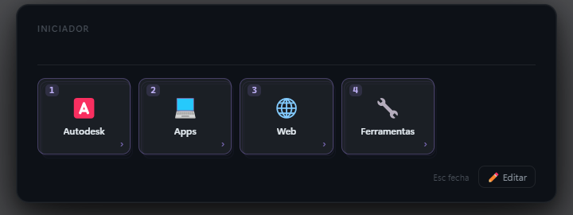

# DesktopHotkeys

Painel de atalhos para Windows que abre por cima de tudo com um atalho de teclado — estilo "Stream Deck", só que via teclado. Cada quadradinho abre um site/programa, roda um comando, ou abre outra pasta de quadradinhos (sem limite de profundidade). Feito em Electron.



## Como usar

- **Abrir / fechar:** `Ctrl + Shift + Alt + P`
- **Escolher:** aperte o número do quadradinho (`1`–`9` e `0` para o décimo)
- **Voltar uma pasta:** `Esc` ou `Backspace`
- **Ir pro início:** `Home`
- **Trocar de página** (muitos itens): `Tab` ou setas `←` `→`
- **Buscar:** comece a digitar o nome
- O app fica na **bandeja** (perto do relógio). Botão direito → editar atalhos, abrir pasta, sair.

## Editar pela interface (sem mexer em arquivo)

Abra o painel → **✏️ Editar** (ou `Ctrl+E`) → clique no **➕ Adicionar** ou em um botão existente.
Dá pra definir nome, ícone (emoji), tipo (📁 Pasta ou ⚡ Ação) e, na ação, o que ela faz.

## Editar pelo arquivo

A configuração fica em **`config.json`** (criado a partir de `config.example.json` na primeira execução).
Cada item é uma `pasta` (lista `filhos`) ou uma `acao` (bloco `acao`). O número é automático, pela ordem.

Tipos de ação:

| Tipo | O que faz | Campos |
|------|-----------|--------|
| `abrir_url` | abre um site | `url` |
| `abrir_arquivo` | abre programa/arquivo/pasta | `caminho` (e opcional `argumentos`) |
| `executar_comando` | roda um comando | `comando`, `shell` (`cmd`/`powershell`) |
| `copiar_texto` | copia texto pra área de transferência | `texto` |
| `enviar_teclas` | envia teclas pro app que estava aberto | `teclas` |

## Rodar (desenvolvimento)

```bash
npm install
npm start
```

## Iniciar com o Windows

Use o `DesktopHotkeys.vbs` (abre o app sem janela de console). Crie um atalho dele na pasta
Inicializar do Windows (`shell:startup`) — ou empacote num `.exe` mais adiante.

## Licença

MIT
