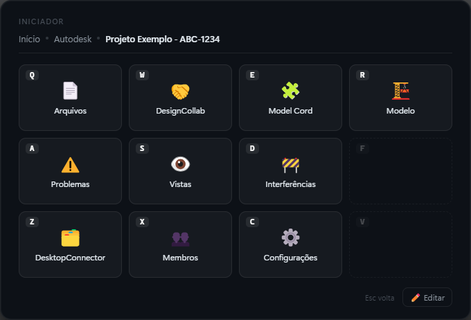
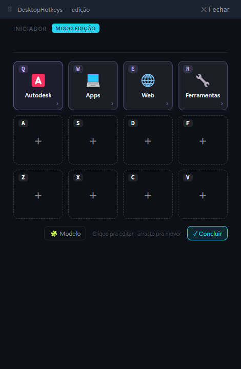
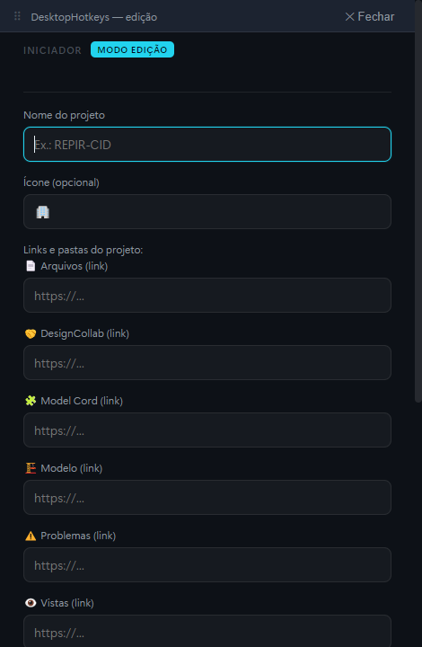
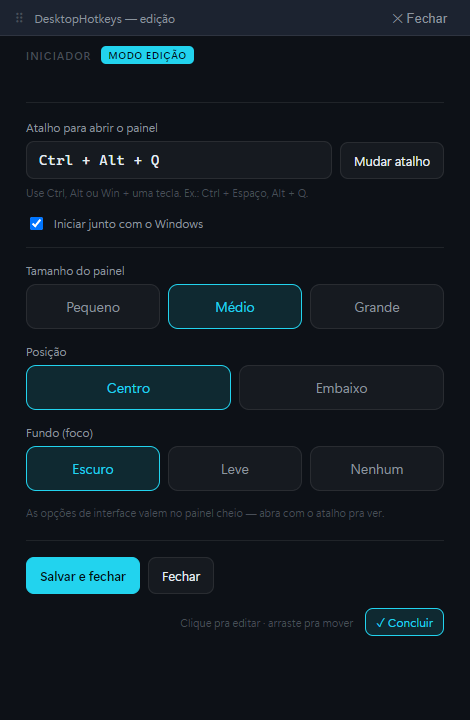

<div align="center">

# 🎛️ DesktopHotkeys

### Seu painel de atalhos pessoal — abre por cima de tudo com um toque, controlado pelo teclado.

Pense num **Stream Deck**, mas dentro do PC e usando o teclado: aperta um atalho, aparece um quadro de botões, e cada botão abre um site, um programa, uma pasta — ou outro quadro de botões.



</div>

---

## ✨ O que é?

O **DesktopHotkeys** é um lançador (launcher) para Windows. Você aperta um atalho global
(de fábrica `Ctrl + Shift + Alt + P`) e um painel aparece sobre qualquer janela. Cada
quadradinho é:

- **⚡ uma Ação** — abre um site, abre um programa/arquivo/pasta, roda um comando, copia um texto; ou
- **📁 uma Pasta** — abre outro quadro de botões (sem limite de profundidade).

Tudo na ponta dos dedos: você nunca tira a mão do teclado.

---

## ⌨️ Como funciona

Os botões ficam numa grade fixa de **12 lugares**, com teclas no estilo **StarCraft** —
fáceis de alcançar com a mão esquerda:

```
 Q   W   E   R
 A   S   D   F
 Z   X   C   V
```

- Apertou a letra → ativa o botão daquele lugar.
- Lugares **vazios ("buracos")** ficam visíveis de propósito: assim cada botão fica
  **sempre na mesma tecla**, e vira memória muscular.
- `Esc` / `Backspace` volta uma pasta · `Home` volta pro início · `Tab` / `← →` troca de página.
- Aperta o atalho global de novo (ou clica fora) → fecha tudo.

> 💡 Exemplo: `Q` (Autodesk) → `Q` (seu projeto) → `A` (Problemas) e o site abre. Um segundo.

---

## 🚀 Recursos

- 🎯 **Acesso em 1 segundo**, 100% pelo teclado
- 🗂️ **Pastas dentro de pastas** sem limite
- 🖼️ **Ícone** com emoji **ou imagem/GIF**
- ✏️ **Editor visual** dentro do app — sem mexer em arquivo
- 🧲 **Arrastar pra reordenar** os botões
- 🧩 **Modelos de projeto** — crie um projeto novo preenchendo todos os links e pastas numa tela só
- 🪟 **Editor em janela móvel** — arraste pela barra ⠿ e deixe do lado do navegador; não escurece a tela
- ⚙️ **Opções de interface** — tamanho (pequeno/médio/grande), posição (centro/embaixo) e fundo (escuro/leve/nenhum)
- 🎚️ **Configurável pela bandeja** — troque o atalho de abertura e ligue "iniciar com o Windows"
- 🔒 Sua configuração (`config.json`) fica **só na sua máquina**

---

## 📸 Telas

**Editor em janela móvel** — ao editar, o painel vira uma janelinha que você arrasta pela barra ⠿ e deixa onde quiser; não escurece a tela.



**Novo projeto pelo modelo** — preencha todos os links e a pasta de uma vez (com o navegador do lado); ele monta os botões pra você.



**Configurações** — atalho de abertura, iniciar com o Windows e opções de interface (tamanho, posição, fundo).



---

## 📦 Rodar (desenvolvimento)

Precisa do [Node.js](https://nodejs.org) instalado.

```bash
git clone https://github.com/otavioesteves1/DesktopHotkeys.git
cd DesktopHotkeys
npm install
npm start
```

Na primeira vez, o app cria seu `config.json` a partir do `config.example.json`.

---

## 🏗️ Gerar o executável (.exe)

```bash
npm install
npm run dist
```

O instalador do Windows é gerado na pasta **`dist/`** (ex.: `DesktopHotkeys Setup x.y.z.exe`),
junto com uma versão **portátil** (`DesktopHotkeys-x.y.z-portable.exe`) que roda sem instalar.
Depois de aberto, o app fica na **bandeja** (perto do relógio) e sobe com o atalho global.

## 🔄 Atualizar sem perder suas configurações

Suas configurações ficam em **`%APPDATA%\DesktopHotkeys\`** — uma pasta **separada do programa**.
Por isso, ao baixar uma versão nova (pelos [Releases](https://github.com/otavioesteves1/DesktopHotkeys/releases))
e abrir por cima, **seus botões, atalhos e ícones continuam intactos**. O app só cria a configuração
inicial se ainda não existir; ele nunca apaga a sua.

---

## ⚙️ Configuração

Você edita de dois jeitos (os dois convivem):

1. **Pela interface** — abra o painel → **✏️ Editar** (ou `Ctrl+E`) → clique nos botões.
2. **Pelo arquivo** — bandeja → botão direito → **Editar atalhos (config.json)**.

Onde fica o `config.json`:

| Situação | Local |
|----------|-------|
| Rodando do código (`npm start`) | pasta do projeto |
| Instalado (.exe) | `%APPDATA%\DesktopHotkeys\config.json` |

### Tipos de ação

| Tipo | O que faz | Campos |
|------|-----------|--------|
| `abrir_url` | abre um site | `url` |
| `abrir_arquivo` | abre programa / arquivo / pasta | `caminho` (e opcional `argumentos`) |
| `executar_comando` | roda um comando | `comando`, `shell` (`cmd` / `powershell`) |
| `copiar_texto` | copia texto pra área de transferência | `texto` |
| `enviar_teclas` | envia teclas pro app que estava aberto | `teclas` |

Cada item é uma `pasta` (com lista `filhos`) ou uma `acao` (com bloco `acao`). A posição na
lista define a tecla (`null` = lugar vazio). Uma pasta pode ter um `modelo` (campos padrão
para criar projetos novos).

---

<div align="center">

Feito com Electron · Licença MIT

</div>
